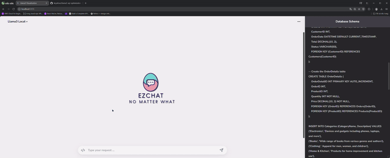

# About the project:

**The project is built on the idea of optimizing SQL query statements. Its goal is to enhance query optimization by leveraging large language models (LLMs). The primary model applied in the project is Llama3, integrated with several techniques to support visual query analysis. Through various extensions, the project aims to directly execute SQL statements and visualize them using different types of charts.**

### **Project Name: Hệ thống kinh doanh phần mềm kĩ thuật số hướng Microservices**

### **Services:**
- ``Frontend`` - React WebApp (Hệ thống bán phần mềm bản quyên DigiKey)
- ``Warehouse`` - Strapi (Module Service trang quản lý và lưu trữ dữ liệu)
- ``Payments`` - ExpressJs (Module Service các cộng thanh toán Stripe, Paypal, ...)
- ``Visualization`` - ChartBrew (Module Service trực quan hóa dữ liệu bằng đồ thị và thống kê)

<div align="center">

<p><a href="http://localhost:3000">DEMO</a></p>
</div>

# Environment:

Setup ``.env-template`` 

```shell
CB_DB_NAME_DEV= [Tên Database]
CB_DB_USERNAME_DEV= [Username]
CB_DB_PASSWORD_DEV= [Password]
```

# Installation:

```shell
# Clone source code từ github
git clone https://github.com/keysKuo/DigiKey-FullStack.git

# Đi vào thư mục gốc
cd DigiKey-FullStack/

# Cài đặt cho module chartbrew (Node 20.x)
cd chartbrew/
npm run setup

# Cài đặt cho module frontend (Node 18.x+)
cd frontend/
npm install

# Cài đặt cho module payments (Node 18.x+)
# Từ thư mục gốc
npm install

# Cài đặt cho module strapi (Node 18.x+)
cd strapi/
npm install
```

# Run app:

```shell 
# Từ thư mục gốc
# Chạy frontend (PORT 3000)
npm run client

# Chạy payments (PORT 4020)
npm run payments

# Chạy strapi (PORT 4021)
npm run strapi

# Chạy chart client (PORT 4018)
npm run chart-client

# Chạy chart api (PORT 4019)
npm run chart-api
```


