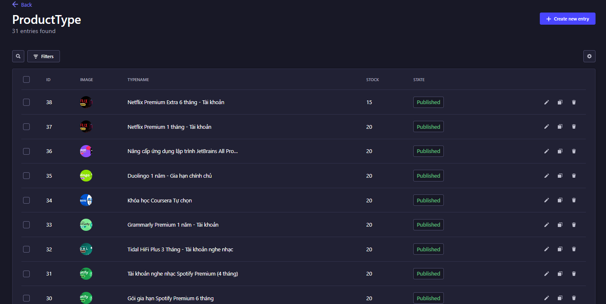

# About the project:

**Project DigiKey: Revolutionizing Digital Software Commerce**

Welcome to DigiKey, a cutting-edge online platform designed for the seamless buying and selling of digital software. Our project, DigiKey, leverages a microservices architecture to deliver a robust, scalable, and efficient solution tailored to the needs of digital software businesses.

**Key Features:**

-   **Warehouse Management with Strapi**: Our backend service utilizes Strapi to provide a flexible and powerful content management system, ensuring efficient and secure handling of your digital products.
-   **Statistics and Visualization with Chartbrew**: Harness the power of data with our integrated Chartbrew service, offering comprehensive statistics and visualization tools to help you make informed business decisions.
-   **Payment Gateways**: Enjoy smooth and secure transactions with our support for leading payment gateways like Stripe and PayPal, ensuring a seamless checkout experience for your customers.
-   **Client App with ReactJS**: Our user-friendly client application, built on ReactJS, provides a dynamic and responsive interface, enhancing user experience and engagement.

### **Services:**

-   `Frontend` - React WebApp (Hệ thống bán phần mềm bản quyên DigiKey)
-   `Warehouse` - Strapi (Module Service trang quản lý và lưu trữ dữ liệu)
-   `Payments` - ExpressJs (Module Service các cộng thanh toán Stripe, Paypal, ...)
-   `Visualization` - ChartBrew (Module Service trực quan hóa dữ liệu bằng đồ thị và thống kê)

<div align="center">

<p><a href="http://localhost:3000">DEMO</a></p>
</div>

# Features:

-   `Searching` - Searching for products
-   `Preview` - Preview product information
-   `Cart` - Handling items in cart
-   `Express Checkout`
    -   Checkout through payment gateways such as: Stripe, Paypal,...
    -   Click & Buy with only email
-   `Management`
    -   Manage authorization by role of admin account
    -   Manage the system warehouse
    -   Manage upload medias
    -   Manage API, Webhooks, Extensions, Third-party,...

<div align="center">

</div>

-   `Visualization` - Statistic transaction through graph visualization

# Built with:

-   [![Nodejs][Node.js]][Node-url]
-   [![ExpressJS][Express.js]][Express-url]
-   [![TailwindCSS][TailwindCSS]][TailwindCSS-url]
-   [![React.js][React.js]][React-url]
-   [![Strapi][Strapi]][Strapi-url]
-   [![ChartBrew][ChartBrew]][ChartBrew-url]
-   [![Stripe][Stripe]][Stripe-url]
-   [![PayPal][PayPal]][PayPal-url]

# Functions:
- Stripe service: 

```javascript
const createStripeSession = async (options) => {
	try {
		const { items, success_url, cancel_url } = options;

		const lineItems = items.map((item) => {
			const unitAmount = Math.round(item.price * 100);
			return {
				price_data: {
					currency: "usd",
					product_data: {
						name: item.name,
						images: [
							item.image ||
								"https://react.semantic-ui.com/images/wireframe/square-image.png",
						],
					},
					unit_amount: unitAmount,
				},
				quantity: item.quantity,
			};
		});

		// console.log(lineItems);

		const session = await stripeGateway.checkout.sessions.create({
			payment_method_types: ["card"],
			mode: "payment",
			success_url: success_url,
			cancel_url: cancel_url,
			line_items: lineItems,
			//  Asking address in Stripe
			billing_address_collection: "required",
		});

		// console.log(session);

		return {
			paymentId: session.id,
			url: session.url,
		};
	} catch (error) {
		console.log(error);
		return undefined;
	}
};
```

- PayPal service: 

```javascript
const createPaypalSession = async (options) => {
	try {
		const { success_url, cancel_url, items, total } = options;
		const create_payment_json = {
			intent: "sale",
			payer: {
				payment_method: "paypal",
			},
			redirect_urls: {
				return_url: success_url,
				cancel_url: cancel_url,
			},
			transactions: [
				{
					item_list: {
						items: items.map((item) => {
							return {
								...item,
								price: item.price.toFixed(2),
								currency: "USD",
							};
						}),
					},
					amount: {
						currency: "USD",
						total: total.toFixed(2),
					},
					description: "SUD payment gateway test",
				},
			],
		};

		const payment = await new Promise((resolve, reject) => {
			paypal.payment.create(
				create_payment_json,
				function (error, payment) {
					if (error) {
						console.log(error.response.details);
						reject(error);
					} else {
						// console.log(payment)
						resolve(payment);
					}
				}
			);
		});

		for (let i = 0; i < payment.links.length; i++) {
			if (payment.links[i].rel === "approval_url") {
				return {
					paymentId: payment.id,
					url: payment.links[i].href,
				};
			}
		}
	} catch (error) {
		console.log(error);
		return undefined;
	}
};

```

# Environment:

Setup `.env-template`

```shell
CB_DB_NAME_DEV= [Tên Database]
CB_DB_USERNAME_DEV= [Username]
CB_DB_PASSWORD_DEV= [Password]
```

# Requirements:

-   MySQL community server 8
-   Node v20.x

# Installation:

```bash
# Clone source code từ github
git clone https://github.com/keysKuo/DigiKey-FullStack.git

# Đi vào thư mục gốc
cd DigiKey-FullStack/

# Cài đặt cho module chartbrew (Node 20.x)
cd chartbrew/
npm run setup

# Cài đặt cho module frontend (Node 18.x+)
cd frontend/
npm install

# Cài đặt cho module payments (Node 18.x+)
# Từ thư mục gốc
npm install

# Cài đặt cho module strapi (Node 18.x+)
cd strapi/
npm install
```

# Run app:

```bash
# Từ thư mục gốc
# Chạy frontend (PORT 3000)
npm run client

# Chạy payments (PORT 4020)
npm run payments

# Chạy strapi (PORT 4021)
npm run strapi

# Chạy chart client (PORT 4018)
npm run chart-client

# Chạy chart api (PORT 4019)
npm run chart-api
```

[TailwindCSS]: https://img.shields.io/badge/Tailwind_CSS-38B2AC?style=for-the-badge&logo=tailwind-css&logoColor=white
[TailwindCSS-url]: https://tailwindcss.com
[React.js]: https://img.shields.io/badge/React-20232A?style=for-the-badge&logo=react&logoColor=61DAFB
[React-url]: https://reactjs.org/
[Node.js]: https://img.shields.io/badge/Node.js-43853D?style=for-the-badge&logo=node.js&logoColor=white
[Node-url]: https://nodejs.org/
[Express.js]: https://img.shields.io/badge/Express.js-404D59?style=for-the-badge
[Express-url]: https://expressjs.com/
[Strapi]: https://img.shields.io/badge/-Strapi-4945FF?style=for-the-badge&logo=strapi&logoColor=white
[Strapi-url]: https://docs.strapi.io/
[ChartBrew]: https://img.shields.io/badge/ChartBrew-E76F51?style=for-the-badge&logo=chartbrew&logoColor=white
[ChartBrew-url]: https://chartbrew.com/
[Stripe]: https://img.shields.io/badge/Stripe-626CD9?style=for-the-badge&logo=Stripe&logoColor=white
[Stripe-url]: https://docs.stripe.com/
[PayPal]: https://img.shields.io/badge/PayPal-00457C?style=for-the-badge&logo=paypal&logoColor=white
[PayPal-url]: https://docs.stripe.com/
