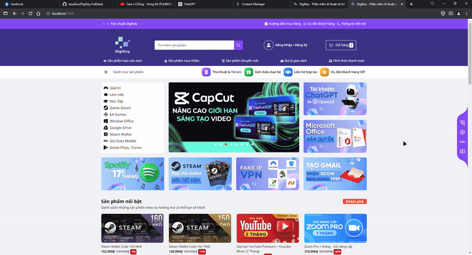

# About the project:

---

**Project DigiKey: Revolutionizing Digital Software Commerce**

Welcome to DigiKey, a cutting-edge online platform designed for the seamless buying and selling of digital software. Our project, DigiKey, leverages a microservices architecture to deliver a robust, scalable, and efficient solution tailored to the needs of digital software businesses.

**Key Features:**

- **Warehouse Management with Strapi**: Our backend service utilizes Strapi to provide a flexible and powerful content management system, ensuring efficient and secure handling of your digital products.
- **Statistics and Visualization with Chartbrew**: Harness the power of data with our integrated Chartbrew service, offering comprehensive statistics and visualization tools to help you make informed business decisions.
- **Payment Gateways**: Enjoy smooth and secure transactions with our support for leading payment gateways like Stripe and PayPal, ensuring a seamless checkout experience for your customers.
- **Client App with ReactJS**: Our user-friendly client application, built on ReactJS, provides a dynamic and responsive interface, enhancing user experience and engagement.

---


### **Services:**

-   `Frontend` - React WebApp (Hệ thống bán phần mềm bản quyên DigiKey)
-   `Warehouse` - Strapi (Module Service trang quản lý và lưu trữ dữ liệu)
-   `Payments` - ExpressJs (Module Service các cộng thanh toán Stripe, Paypal, ...)
-   `Visualization` - ChartBrew (Module Service trực quan hóa dữ liệu bằng đồ thị và thống kê)

<div align="center">

<p><a href="http://localhost:3000">DEMO</a></p>
</div>

# Features:
- `Searching` - Searching for products
- `Preview` - Preview product information
- `Cart` - Handling items in cart 
- `Express Checkout`
    - Checkout through payment gateways such as: Stripe, Paypal,...
    - Click & Buy with only email
- `Management` 
    - Manage authorization by role of admin account
    - Manage the system warehouse
    - Manage upload medias
    - Manage API, Webhooks, Extensions, Third-party,...

<div align="center">

</div>

- `Visualization` - Statistic transaction through graph visualization


# Environment:

Setup `.env-template`

```shell
CB_DB_NAME_DEV= [Tên Database]
CB_DB_USERNAME_DEV= [Username]
CB_DB_PASSWORD_DEV= [Password]
```

# Installation:

```bash
# Clone source code từ github
git clone https://github.com/keysKuo/DigiKey-FullStack.git

# Đi vào thư mục gốc
cd DigiKey-FullStack/

# Cài đặt cho module chartbrew (Node 20.x)
cd chartbrew/
npm run setup

# Cài đặt cho module frontend (Node 18.x+)
cd frontend/
npm install

# Cài đặt cho module payments (Node 18.x+)
# Từ thư mục gốc
npm install

# Cài đặt cho module strapi (Node 18.x+)
cd strapi/
npm install
```

# Run app:

```bash
# Từ thư mục gốc
# Chạy frontend (PORT 3000)
npm run client

# Chạy payments (PORT 4020)
npm run payments

# Chạy strapi (PORT 4021)
npm run strapi

# Chạy chart client (PORT 4018)
npm run chart-client

# Chạy chart api (PORT 4019)
npm run chart-api
```

